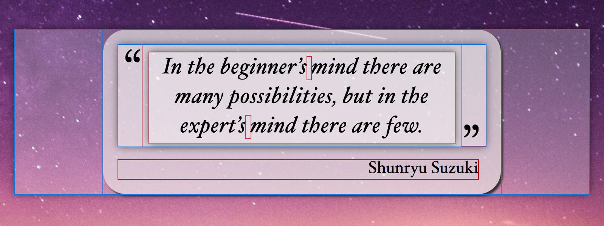
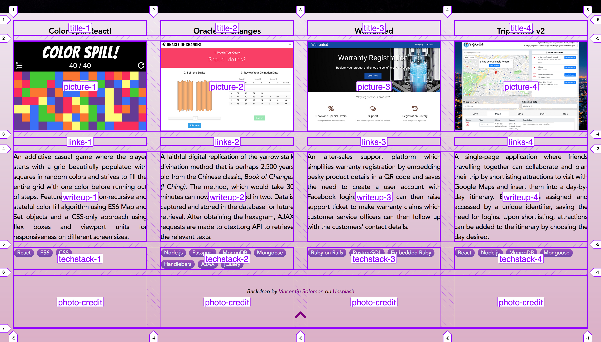
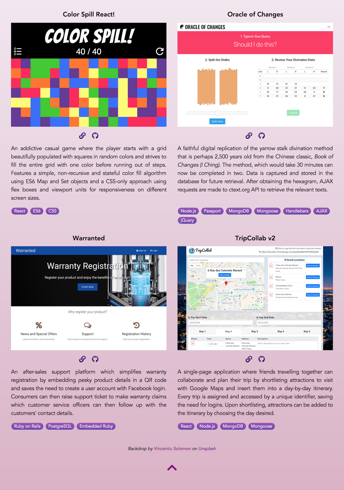
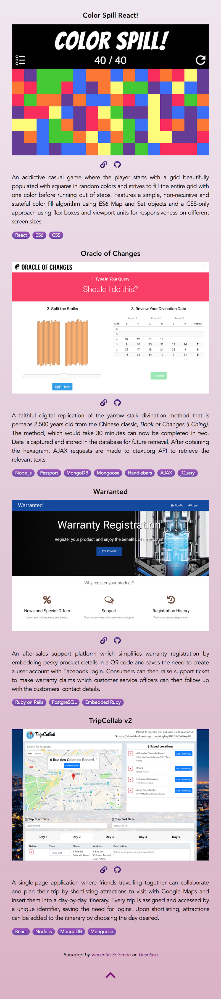

# Project Portfolio

<h3 align="center"><a href="https://jiechaolim.com">https://jiechaolim.com</a></h3>

<p align="center"></p>

## Features
- Displays correctly and beautifully on *all* screen sizes
- Serves the most optimal layout according to design breakpoints
- *No* CSS framework
- *No* JavaScript
- CSS grid and media queries for *responsive* layouts
  - 4-column × 1-row grid for >`1184px` width,
  - 2-column × 2-row grid for <`1184px` width
  - 1-column × 4-row grid for <`608px` width
- CSS flexbox
  - Responsive placement of quote marks enclosing the headline quotation
  - Quote marks will *not* touch the quotation or be awkwardly positioned
- CSS gradient
  - Portfolio backdrop,
  - Badges for language, framework, database used
  - Fallback backdrop

## CSS Flexbox

### Headline Quotation

#### Screenshot

<p align="center"></p>

#### CSS

```css
.carousel-deck {
  display: flex;
  width: 100%;
  overflow-x: scroll;
  scroll-snap-type: x mandatory;
  scroll-behavior: smooth;
}

/* Hides scrollbar in firefox */
.carousel-deck {
  scrollbar-width: none;
}

/* Hides scrollbar in webkit and blink powered browsers */
.carousel-deck::-webkit-scrollbar {
  display: none;
}

.carousel-card {
  display: flex;
  justify-content: center;
  min-width: 100%;
  margin: 3.125rem;
  margin: 1.5rem;
  position: relative;
  scroll-snap-align: start;
  transform: scale(1);
  transform-origin: center center;
  transition: transform .5s;
  outline: 0;
}
```

## CSS Grid

### 4-column × 1-row

#### Screenshot

<p align="center"></p>

#### Screenshot

```css
.portfolio {
  background: #8e9eab;  /* fallback for old browsers */
  background: -webkit-linear-gradient(to top, rgba(236, 233, 230, 0.75), rgba(255, 255, 255, 0.9));  /* Chrome 10-25, Safari 5.1-6 */
  background: linear-gradient(to top, rgba(236, 233, 230, 0.75), rgba(255, 255, 255, 0.9)); /* W3C, IE 10+/ Edge, Firefox 16+, Chrome 26+, Opera 12+, Safari 7+ */
  color: black;
  padding: 1rem 2rem 2rem 2rem;
  display: grid;
  grid-template-columns: repeat(4, 1fr);
  grid-template-rows: repeat(5, auto);
  grid-row-gap: 0.8rem;
  grid-column-gap: 2rem;
  grid-template-areas:
    "title-1      title-2      title-3      title-4"
    "picture-1    picture-2    picture-3    picture-4"
    "links-1      links-2      links-3      links-4"
    "writeup-1    writeup-2    writeup-3    writeup-4"
    "techstack-1  techstack-2  techstack-3  techstack-4"
    "photo-credit photo-credit photo-credit photo-credit";
}
```

### 2-column × 2-row

#### Screenshot

<p align="center"></p>

#### CSS

```css
@media screen and (max-width: 1184px) {
  .top-half {
    background-image: url("../images/lighthouse-b.jpg");
  }

  .portfolio {
    grid-template-columns: repeat(2, 1fr);
    grid-template-rows: repeat(10, auto);
    grid-row-gap: 0.8rem;
    grid-column-gap: 2rem;
    grid-template-areas:
      "title-1      title-2"
      "picture-1    picture-2"
      "links-1      links-2"
      "writeup-1    writeup-2"
      "techstack-1  techstack-2"
      "title-3      title-4"
      "picture-3    picture-4"
      "links-3      links-4"
      "writeup-3    writeup-4"
      "techstack-3  techstack-4"
      "photo-credit photo-credit";
  }
}
```

### 1-column × 4-row


#### Screenshot

<p align="center"></p>

#### CSS

```css
@media screen and (max-width: 608px) {
  .portfolio {
    grid-template-columns: repeat(1, 1fr);
    grid-template-rows: repeat(20, auto);
    grid-row-gap: 0.7rem;
    grid-column-gap: 2rem;
    grid-template-areas:
      "title-1"
      "picture-1"
      "links-1"
      "writeup-1"
      "techstack-1"
      "title-2"
      "picture-2"
      "links-2"
      "writeup-2"
      "techstack-2"
      "title-3"
      "picture-3"
      "links-3"
      "writeup-3"
      "techstack-3"
      "title-4"
      "picture-4"
      "links-4"
      "writeup-4"
      "techstack-4"
      "photo-credit";
  }
}
```
